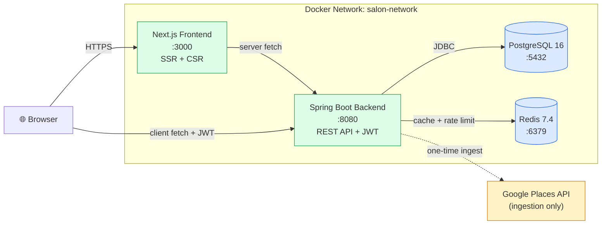
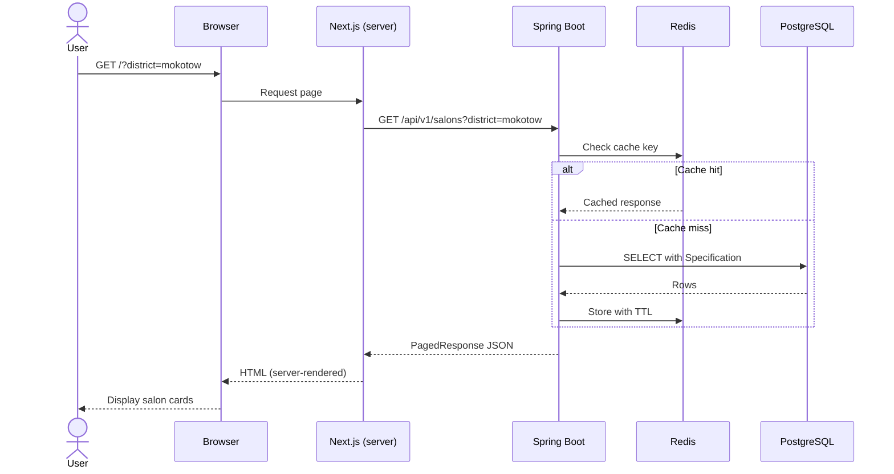
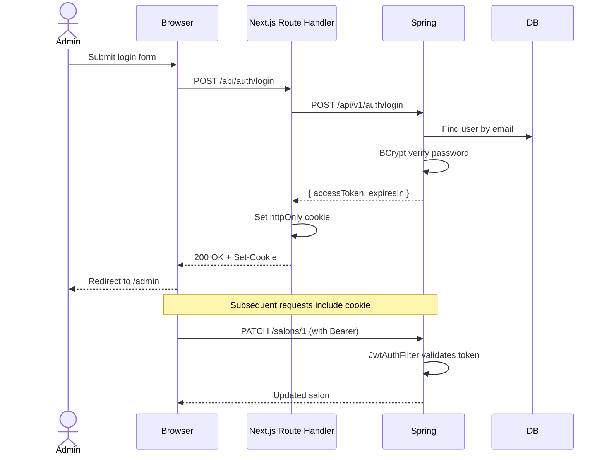
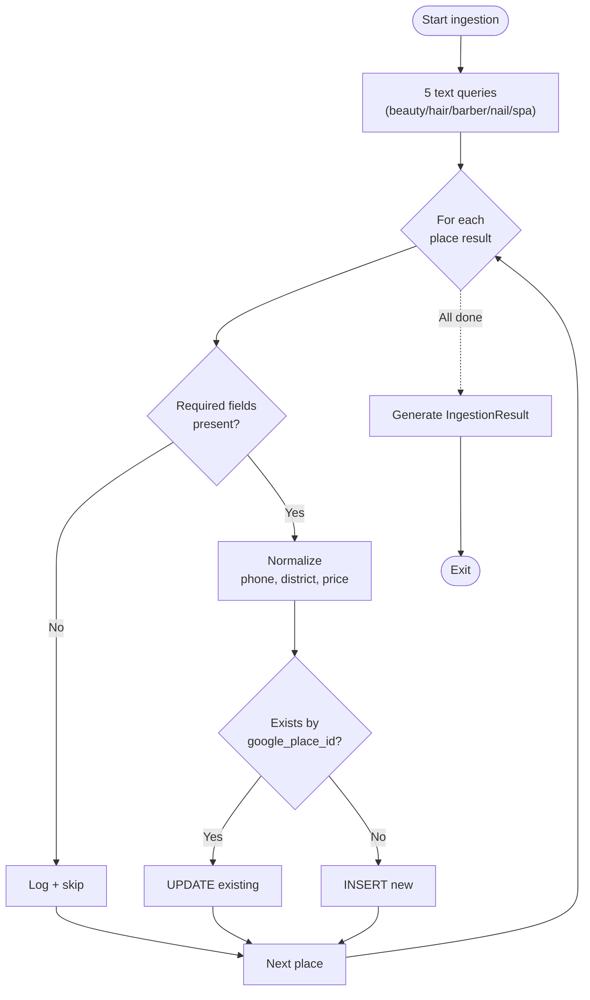
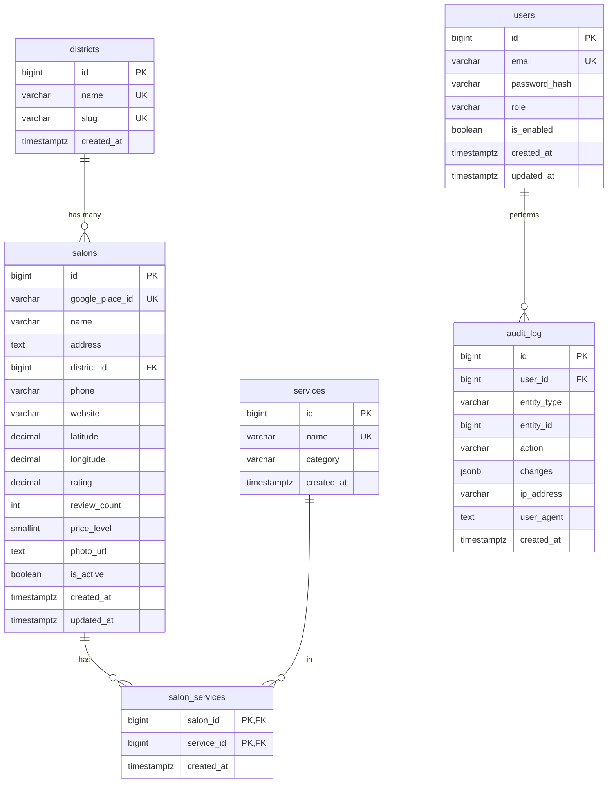

# Phase 6: README, GitHub & CI/CD

> **Hedef:** Projeyi mülakatçıya teslim edilebilir hale getirmek. Profesyonel README, mimari diagram'ları, demo GIF, CI/CD pipeline, branch protection, commit hijyeni. Recruiter'ın repo'yu açtığında 30 saniyede ne yaptığını anlamasını sağlamak.

---

## 📋 İçindekiler

1. [Faz Özeti](#1-faz-özeti)
2. [Proje Final Yapısı](#2-proje-final-yapısı)
3. [Profesyonel README.md](#3-profesyonel-readmemd)
4. [Mimari ve ER Diagram'ları](#4-mimari-ve-er-diagramları)
5. [Demo Materyalleri](#5-demo-materyalleri)
6. [GitHub Actions CI Pipeline](#6-github-actions-ci-pipeline)
7. [Branch Protection & PR Workflow](#7-branch-protection--pr-workflow)
8. [Commit Hijyeni](#8-commit-hijyeni)
9. [Ek Repo Dosyaları](#9-ek-repo-dosyaları)
10. [Postman/Bruno Collection](#10-postmanbruno-collection)
11. [Mülakat Hazırlığı](#11-mülakat-hazırlığı)
12. [Submission Checklist](#12-submission-checklist)
13. [Mülakat Soruları](#13-mülakat-soruları)
14. [Definition of Done](#14-definition-of-done)

---

## 1. Faz Özeti

**Bu fazın sonunda elimizde olacaklar:**

- Production-quality `README.md` (mimari, setup, API docs, "what I'd improve")
- Mimari diagram (Mermaid)
- ER diagram (Mermaid)
- Demo GIF/video (homepage flow + edit flow)
- Screenshots klasörü
- GitHub Actions CI pipeline (lint + test + build)
- Branch protection rules
- PR template, issue templates
- Conventional commits ile temiz history
- LICENSE (MIT)
- CONTRIBUTING.md
- API Postman/Bruno collection
- 4 farklı SumUp mülakat sorusu için hazır cevap

**Bu fazda YAPMAYACAĞIZ:**

- Production deployment (out of scope)
- Yeni feature eklemek

---

## 2. Proje Final Yapısı

```
warsaw-salon-explorer/
├── .github/
│   ├── workflows/
│   │   ├── ci.yml                     # Ana CI pipeline
│   │   ├── docker-build.yml           # Image build & scan
│   │   └── pr-checks.yml              # PR-specific kontroller
│   ├── ISSUE_TEMPLATE/
│   │   ├── bug_report.md
│   │   └── feature_request.md
│   ├── pull_request_template.md
│   └── dependabot.yml                 # Otomatik dependency updates
├── backend/                            # Faz 1-3'ten
├── frontend/                           # Faz 4'ten
├── docker/                             # Faz 1+5'ten
│   └── postgres/
│       └── init/
├── docs/
│   ├── architecture.md
│   ├── api.md
│   ├── images/
│   │   ├── architecture-diagram.png
│   │   ├── er-diagram.png
│   │   ├── homepage-screenshot.png
│   │   ├── detail-screenshot.png
│   │   ├── edit-screenshot.png
│   │   └── demo.gif
│   └── postman/
│       └── salon-explorer.postman_collection.json
├── .env.example
├── .gitignore
├── .editorconfig
├── docker-compose.yml
├── docker-compose.ingest.yml
├── LICENSE
├── README.md                           # Ana README
└── CONTRIBUTING.md
```

---

## 3. Profesyonel README.md

### 3.1 Yapı (top to bottom)

```
1. Project title + tagline + badge'ler
2. Hero image / demo GIF
3. Quick links (live demo, docs, API)
4. Table of Contents
5. Overview (1 paragraf, ne yapıyor)
6. Features (bullet list)
7. Tech Stack (table)
8. Architecture diagram
9. Getting Started (tek komut)
10. Environment variables
11. API documentation (Swagger link + key endpoints)
12. Data collection (Google Places kararı)
13. Project structure
14. Testing
15. What I'd improve with more time     ← KRİTİK
16. Decisions & Trade-offs              ← KRİTİK
17. License
```

### 3.2 `README.md` (tam içerik)

````markdown
<div align="center">

# 🇵🇱 Warsaw Salon Explorer

**Discover beauty salons across Warsaw — a full-stack showcase project.**

[](https://github.com/kaandev/warsaw-salon-explorer/actions/workflows/ci.yml)
[](LICENSE)
[](https://openjdk.org/)
[](https://spring.io/projects/spring-boot)
[](https://nextjs.org/)
[](https://www.postgresql.org/)


</div>

---

## 📖 Overview

Warsaw Salon Explorer is a full-stack web application that aggregates and presents beauty/hair salons across Warsaw, Poland. Built as a take-home assignment for SumUp's Software Engineer Internship, it demonstrates a production-grade approach to **data ingestion**, **REST API design**, **modern frontend architecture**, and **DevOps practices**.

The system ingests salon data from the Google Places API, normalizes and deduplicates it, persists it in PostgreSQL, exposes it through a Spring Boot REST API with JWT authentication, and renders it via a Next.js App Router frontend with TanStack Query and shadcn/ui.

---

## ✨ Features

- 🔍 **Browse 100+ Warsaw salons** with filtering by district, service, rating, and price
- 🗺️ **18 official Warsaw districts** with normalized data
- ⚡ **Server-side rendering** for SEO and fast first paint
- 🔐 **JWT authentication** with httpOnly cookies, BCrypt password hashing
- 📝 **Admin edit interface** with optimistic updates and form validation
- 🛡️ **Rate limiting**, **CORS**, **audit logging**, **least-privilege DB users**
- 📊 **Redis caching** for hot reads
- 🐳 **One-command deployment** with Docker Compose
- 📐 **OpenAPI / Swagger UI** for interactive API exploration
- ♿ **WCAG 2.1 AA accessible** UI
- ✅ **Unit + integration + e2e tests** (JUnit 5, Testcontainers, Vitest, Playwright)

---

## 🛠️ Tech Stack

| Layer | Technology | Reasoning |
|-------|-----------|-----------|
| **Backend** | Java 21 (LTS), Spring Boot 3.5 | Modern Java with records, virtual threads, strong ecosystem |
| **API** | Spring MVC, Spring Data JPA, Spring Security | Battle-tested, opinionated, fast to develop |
| **Auth** | JWT (jjwt 0.12), BCrypt | Stateless, horizontally scalable |
| **Validation** | Jakarta Bean Validation | Standard, declarative |
| **Mapping** | MapStruct 1.6 | Compile-time, zero runtime overhead |
| **DB Migration** | Flyway 10 | SQL-first, version-controlled schema |
| **Database** | PostgreSQL 16 | ACID, JSONB, pg_trgm, mature |
| **Cache** | Redis 7.4 | In-memory speed, distributed rate limiting |
| **Resilience** | Resilience4j (retry, rate limiter) | Modern, lightweight |
| **HTTP Client** | Spring RestClient | Modern synchronous client |
| **Frontend** | Next.js 16 (App Router), React 19 | Server Components, streaming, SEO |
| **Language** | TypeScript 5 (strict) | Type safety end-to-end |
| **Styling** | Tailwind CSS 4, shadcn/ui | Utility-first, owned components |
| **State** | TanStack Query 5, react-hook-form, Zod | Server state + form state + schema validation |
| **Containerization** | Docker, Docker Compose | Reproducible builds, dev-prod parity |
| **CI/CD** | GitHub Actions | Native to GitHub, free for public repos |
| **Testing** | JUnit 5, Mockito, Testcontainers, Vitest, Playwright | Layered test pyramid |
| **API Docs** | springdoc-openapi 2.6 | Auto-generated from annotations |

---

## 🏗️ Architecture


```
Browser → Next.js (SSR + CSR) → Spring Boot API → PostgreSQL
                                       ↓
                                     Redis (cache + rate limit)
                                       ↑
                          Google Places API (one-time ingestion)
```

**Key architectural decisions:**

- **Server Components by default** — JavaScript bundle stays small; data fetches happen server-to-server
- **Photo proxy** — Google Places photos are streamed through the backend so the API key never reaches the client
- **Two-user DB pattern** — Admin user runs Flyway migrations (DDL); the application user has only DML privileges (least privilege)
- **Layered JAR + multi-stage Docker** — Backend image is 250MB, frontend 180MB
- **Idempotent ingestion** — Upsert by `google_place_id`; re-runs only update existing records

See [docs/architecture.md](docs/architecture.md) for a deeper dive.

---

## 🚀 Getting Started

### Prerequisites

- Docker 24+ and Docker Compose v2
- Google Places API key with **Places API (New)** and **Geocoding API** enabled

### 1. Clone & configure

```bash
git clone https://github.com/kaandev/warsaw-salon-explorer.git
cd warsaw-salon-explorer

cp .env.example .env

# Generate strong secrets
sed -i "s|__POSTGRES_PASSWORD__|$(openssl rand -base64 24)|"  .env
sed -i "s|__APP_DB_PASSWORD__|$(openssl rand -base64 24)|"    .env
sed -i "s|__REDIS_PASSWORD__|$(openssl rand -base64 24)|"     .env
sed -i "s|__JWT_SECRET__|$(openssl rand -base64 32)|"         .env

# Add your Google Places API key
echo "GOOGLE_MAPS_API_KEY=your_key_here" >> .env
```

### 2. Run

```bash
docker compose up -d
```

Wait ~90 seconds for all services to be healthy:

```bash
docker compose ps
# All four services should show "Up (healthy)"
```

### 3. Ingest salon data (first run)

```bash
docker compose -f docker-compose.yml -f docker-compose.ingest.yml run --rm ingestion
```

This fetches 100+ salons from Google Places and populates the database. Takes about 60 seconds.

### 4. Open the app

- 🌐 **Frontend:** http://localhost:3000
- 📡 **API:** http://localhost:8080/api/v1
- 📘 **Swagger UI:** http://localhost:8080/swagger-ui.html
- 🩺 **Health:** http://localhost:8080/actuator/health

### Admin credentials (default)

```
Email:    admin@salonexplorer.local
Password: Admin123!
```

> ⚠️ Change immediately for any non-local deployment.

---

## 🔧 Environment Variables

All configuration is in `.env`. See [`.env.example`](.env.example) for the full list.

| Variable | Purpose | Required |
|----------|---------|----------|
| `POSTGRES_PASSWORD` | Admin DB password (Flyway) | ✅ |
| `APP_DB_PASSWORD` | Application DB user password | ✅ |
| `REDIS_PASSWORD` | Redis auth | ✅ |
| `JWT_SECRET` | 256-bit base64 — JWT signing key | ✅ |
| `GOOGLE_MAPS_API_KEY` | For data ingestion | Required for ingest |
| `PUBLIC_API_URL` | Public URL the browser uses | Default OK |

---

## 📡 API Documentation

The API follows REST conventions with **versioning** (`/api/v1/`) and returns RFC 7807 Problem Details on errors.

### Key endpoints

| Method | Path | Auth | Description |
|--------|------|------|-------------|
| `GET` | `/api/v1/salons` | Public | List salons (pagination, filters) |
| `GET` | `/api/v1/salons/{id}` | Public | Get salon details |
| `PUT` | `/api/v1/salons/{id}` | Admin | Full update |
| `PATCH` | `/api/v1/salons/{id}` | Admin | Partial update |
| `DELETE` | `/api/v1/salons/{id}` | Admin | Soft delete |
| `GET` | `/api/v1/districts` | Public | All 18 Warsaw districts |
| `GET` | `/api/v1/services` | Public | Service catalog |
| `POST` | `/api/v1/auth/login` | Public | Returns JWT |

### Query parameters (`GET /salons`)

```
?district=mokotow&service=haircut&minRating=4.0
&maxPriceLevel=2&search=anna&page=0&size=20&sort=rating,desc
```

### Try it out

```bash
# List salons
curl http://localhost:8080/api/v1/salons | jq '.content[0]'

# Filter
curl "http://localhost:8080/api/v1/salons?district=mokotow&minRating=4.5" | jq

# Login + update
TOKEN=$(curl -s -X POST http://localhost:8080/api/v1/auth/login \
  -H "Content-Type: application/json" \
  -d '{"email":"admin@salonexplorer.local","password":"Admin123!"}' | jq -r .accessToken)

curl -X PATCH http://localhost:8080/api/v1/salons/1 \
  -H "Authorization: Bearer $TOKEN" \
  -H "Content-Type: application/json" \
  -d '{"rating": 4.9}'
```

Full interactive docs at **http://localhost:8080/swagger-ui.html**.

A Postman collection is available at [`docs/postman/salon-explorer.postman_collection.json`](docs/postman/salon-explorer.postman_collection.json).

---

## 📊 Data Collection

Data is sourced from the **Google Places API (New)** — the official, ToS-compliant route. I chose Places over scraping Booksy/Yelp because:

1. **Stable contract** — Official API, schema doesn't break overnight
2. **Built-in deduplication** — `google_place_id` is globally unique
3. **Geographic precision** — Geocoding API gives district resolution
4. **Defensible in an interview** — Easy to explain trade-offs

The ingestion service runs five queries (`beauty salon`, `hair salon`, `barber`, `nail salon`, `spa` — all in Warsaw) and upserts results. Phone numbers are normalized to E.164 via Google's libphonenumber. Districts are matched via Polish-aware slug normalization (`Śródmieście → srodmiescie`).

See [docs/architecture.md#data-ingestion](docs/architecture.md) for the full pipeline.

---

## 📁 Project Structure

```
warsaw-salon-explorer/
├── backend/                Spring Boot service
│   └── src/main/java/com/kaandev/salonexplorer/
│       ├── config/          # Security, CORS, Redis, OpenAPI
│       ├── controller/      # REST endpoints
│       ├── service/         # Business logic
│       ├── repository/      # JPA repos
│       ├── domain/          # Entities, DTOs, enums, specs
│       ├── mapper/          # MapStruct mappers
│       ├── security/        # JWT filter, user details
│       ├── ingestion/       # Google Places client + normalizer
│       └── exception/       # Global handler
├── frontend/                Next.js app
│   └── src/
│       ├── app/              # App Router pages
│       ├── components/       # UI components
│       ├── lib/              # API client, hooks, types
│       └── middleware.ts     # Auth guard
├── docker/                  Init scripts
├── docs/                    Diagrams, screenshots, postman
└── docker-compose.yml       Single-command stack
```

---

## 🧪 Testing

```bash
# Backend
cd backend && ./mvnw test

# Frontend unit
cd frontend && npm test

# Frontend e2e (needs stack running)
cd frontend && npm run test:e2e
```

**Coverage:**
- Backend service layer: 70%+ (Mockito)
- Backend integration: Testcontainers with real PostgreSQL
- Frontend components: Vitest + Testing Library
- Frontend e2e: Playwright (listing + detail + edit flow)

---

## 🚧 What I'd Improve With More Time

This is a 4-8 hour take-home; here's what I'd add to make it production-grade:

### Infrastructure
- **Elasticsearch** for full-text search (currently `pg_trgm` — good but limited)
- **Kubernetes manifests** with Kustomize overlays for staging/production
- **Managed databases** (RDS/Cloud SQL) with read replicas, automated backups, PITR
- **Observability**: OpenTelemetry → Tempo/Jaeger for traces, Prometheus + Grafana for metrics, Loki for logs, Sentry for errors
- **CDN** in front of frontend; image CDN (Cloudinary) for photos

### Data
- **Event-driven ingestion**: Kafka topic per city, worker pool consumes, dead-letter queue for failures
- **Incremental sync**: Track `last_synced_at`, only refresh stale records (>30 days)
- **Multi-source enrichment**: Cross-reference Booksy/Facebook for richer service data
- **Polygon-based district resolution**: GeoJSON of Warsaw dzielnice boundaries + point-in-polygon, more reliable than text matching

### Backend
- **Service mesh**: Split ingestion into a separate service, communicate via Kafka
- **API gateway** (Kong/Traefik): centralize rate limiting, auth, observability
- **Refresh tokens** with rotation; revocation via Redis blacklist
- **Multi-tenancy** for scaling to all of Poland (each city → tenant)
- **Distributed cache invalidation**: event-driven (`SalonUpdatedEvent` → invalidate keys)
- **OpenAPI-driven type generation**: backend DTO → frontend types automatically

### Frontend
- **Map view** with clustering (Mapbox GL or Leaflet)
- **Internationalization** (next-intl): pl/en/uk languages
- **Progressive Web App**: offline read, install banner
- **Booking flow**: integrate with provider APIs
- **User-generated content**: reviews, photo uploads (with moderation)
- **A/B testing infrastructure** for filter UX

### DevOps & Security
- **Secrets management**: AWS Secrets Manager / HashiCorp Vault
- **OWASP ZAP scan** in CI
- **Trivy image scanning** blocking critical CVEs
- **Snyk dependency monitoring**
- **Audit log export** to SIEM
- **GDPR compliance**: data deletion endpoints, consent flow, PII redaction in logs

---

## 🤔 Decisions & Trade-offs

| Decision | Chose | Trade-off |
|----------|-------|-----------|
| Data source | Google Places API | Less data than scraping, but stable + legal |
| Deduplication | `google_place_id` UNIQUE | Only handles Google-sourced data; multi-source would need fuzzy matching |
| Cache | Redis | Adds operational complexity vs. in-process cache; gained: distributed, persistent across restarts |
| JWT storage | httpOnly cookie | CSRF surface area; mitigated with SameSite=Lax |
| Migration | Flyway over Liquibase | XML/YAML vs SQL; team can debug SQL directly |
| Mapping | MapStruct over manual | Compile-time complexity; gained: zero runtime overhead + type safety |
| Frontend rendering | Server Components | Less interactivity by default; gained: smaller bundle, SEO |
| Containerization | Compose over k8s | Single-host only; gained: minutes to set up, perfect for this scope |

---

## 📝 License

[MIT](LICENSE) © 2026 Kaan Yavuz

---

<div align="center">

Built with care by [Kaan Yavuz](https://mustafakaanyavuz.com) for the SumUp Warsaw Accelerator Internship 2026.

</div>
````

---

## 4. Mimari ve ER Diagram'ları

### 4.1 Mimari diagram (Mermaid)

`docs/architecture.md`:

````markdown
# Architecture

## System overview



## Request flow: salon listing



## Authentication flow



## Data ingestion pipeline


````

### 4.2 ER diagram (Mermaid)

Yine `docs/architecture.md` içinde:

````markdown
## Database schema


````

> Mermaid diagram'ları GitHub'da otomatik render olur. Image dosyası gerekmez.

---

## 5. Demo Materyalleri

### 5.1 Screenshots

`docs/images/` altında:
- `homepage-screenshot.png` — listing + filtreler açık
- `detail-screenshot.png` — detay sayfası
- `edit-screenshot.png` — edit formu
- `swagger-screenshot.png` — Swagger UI

Çekim ipuçları:
- 1920×1080 viewport (max görünür alan)
- Browser zoom %100
- DevTools kapalı
- Real data görünsün (en az 1 sayfa salon)
- Light mode (kontrast iyi)

### 5.2 Demo GIF

```bash
# Linux/macOS - peek veya kap kullan
# Önerilen: Kap (https://getkap.co) — Mac
# Önerilen: peek (apt install peek) — Linux
# Önerilen: ScreenToGif — Windows
```

GIF içeriği (15-20 saniye):
1. Homepage'i göster (3s)
2. District filter seç → liste update olur (3s)
3. Rating filter ekle → liste daha da daralır (2s)
4. Bir card'a tıkla → detail page açılır (3s)
5. Browser back → listing (1s)
6. Login → admin görünür (3s)
7. Edit page → rating değiştir → save → toast (5s)

**Boyut limiti:** GIF GitHub'da 10MB max render eder, 25MB'a kadar upload olur. `gifsicle -O3 demo.gif -o demo-optimized.gif` ile sıkıştır.

### 5.3 Screenshots oluşturma checklist

```bash
mkdir -p docs/images

# Tüm stack ayakta olmalı
docker compose up -d
docker compose -f docker-compose.yml -f docker-compose.ingest.yml run --rm ingestion

# Browser açık:
# http://localhost:3000              → homepage-screenshot.png
# http://localhost:3000/salons/1     → detail-screenshot.png
# http://localhost:3000/salons/1/edit → edit-screenshot.png
# http://localhost:8080/swagger-ui   → swagger-screenshot.png
```

---

## 6. GitHub Actions CI Pipeline

### 6.1 `.github/workflows/ci.yml`

```yaml
name: CI

on:
  push:
    branches: [main, develop]
  pull_request:
    branches: [main, develop]

concurrency:
  group: ${{ github.workflow }}-${{ github.ref }}
  cancel-in-progress: true

jobs:
  # ───────────────────────────────────────────────
  # Backend
  # ───────────────────────────────────────────────
  backend:
    name: Backend (Java 21)
    runs-on: ubuntu-latest

    services:
      postgres:
        image: postgres:16-alpine
        env:
          POSTGRES_DB: salon_explorer_test
          POSTGRES_USER: test_admin
          POSTGRES_PASSWORD: test_password
        ports:
          - 5432:5432
        options: >-
          --health-cmd pg_isready
          --health-interval 10s
          --health-timeout 5s
          --health-retries 5

      redis:
        image: redis:7.4-alpine
        ports:
          - 6379:6379
        options: >-
          --health-cmd "redis-cli ping"
          --health-interval 10s
          --health-timeout 5s
          --health-retries 5

    steps:
      - uses: actions/checkout@v4

      - name: Set up JDK 21
        uses: actions/setup-java@v4
        with:
          java-version: '21'
          distribution: 'temurin'
          cache: maven

      - name: Compile
        working-directory: ./backend
        run: ./mvnw -B compile

      - name: Run tests
        working-directory: ./backend
        env:
          SPRING_DATASOURCE_URL: jdbc:postgresql://localhost:5432/salon_explorer_test
          SPRING_DATASOURCE_USERNAME: test_admin
          SPRING_DATASOURCE_PASSWORD: test_password
          SPRING_FLYWAY_URL: jdbc:postgresql://localhost:5432/salon_explorer_test
          SPRING_FLYWAY_USER: test_admin
          SPRING_FLYWAY_PASSWORD: test_password
          SPRING_DATA_REDIS_HOST: localhost
          SPRING_DATA_REDIS_PORT: 6379
          SECURITY_JWT_SECRET: Y2lfdGVzdF9zZWNyZXRfMzJfYnl0ZXNfbG9uZ19lbm91Z2hfbm93
        run: ./mvnw -B test

      - name: Upload test results
        if: always()
        uses: actions/upload-artifact@v4
        with:
          name: backend-test-results
          path: backend/target/surefire-reports/

      - name: Generate coverage report
        if: success()
        working-directory: ./backend
        run: ./mvnw -B jacoco:report

      - name: Upload coverage
        if: success()
        uses: actions/upload-artifact@v4
        with:
          name: backend-coverage
          path: backend/target/site/jacoco/

  # ───────────────────────────────────────────────
  # Frontend
  # ───────────────────────────────────────────────
  frontend:
    name: Frontend (Node 20)
    runs-on: ubuntu-latest

    steps:
      - uses: actions/checkout@v4

      - name: Set up Node.js
        uses: actions/setup-node@v4
        with:
          node-version: '20'
          cache: 'npm'
          cache-dependency-path: frontend/package-lock.json

      - name: Install dependencies
        working-directory: ./frontend
        run: npm ci

      - name: Lint
        working-directory: ./frontend
        run: npm run lint

      - name: Type-check
        working-directory: ./frontend
        run: npx tsc --noEmit

      - name: Unit tests
        working-directory: ./frontend
        run: npm test -- --run

      - name: Build
        working-directory: ./frontend
        env:
          NEXT_PUBLIC_API_URL: http://localhost:8080/api/v1
          NEXT_TELEMETRY_DISABLED: 1
        run: npm run build

  # ───────────────────────────────────────────────
  # Docker build smoke test
  # ───────────────────────────────────────────────
  docker:
    name: Docker build
    runs-on: ubuntu-latest
    needs: [backend, frontend]
    if: github.event_name == 'push'

    steps:
      - uses: actions/checkout@v4

      - name: Set up Docker Buildx
        uses: docker/setup-buildx-action@v3

      - name: Build backend image
        uses: docker/build-push-action@v5
        with:
          context: ./backend
          push: false
          tags: salon-backend:ci
          cache-from: type=gha
          cache-to: type=gha,mode=max

      - name: Build frontend image
        uses: docker/build-push-action@v5
        with:
          context: ./frontend
          push: false
          tags: salon-frontend:ci
          build-args: |
            NEXT_PUBLIC_API_URL=http://localhost:8080/api/v1
          cache-from: type=gha
          cache-to: type=gha,mode=max

      - name: Run Trivy vulnerability scanner (backend)
        uses: aquasecurity/trivy-action@master
        with:
          image-ref: salon-backend:ci
          severity: CRITICAL,HIGH
          exit-code: '0'                    # Bilgi amaçlı (block etmiyoruz şimdilik)
          format: table

      - name: Run Trivy vulnerability scanner (frontend)
        uses: aquasecurity/trivy-action@master
        with:
          image-ref: salon-frontend:ci
          severity: CRITICAL,HIGH
          exit-code: '0'
          format: table
```

### 6.2 `.github/workflows/pr-checks.yml`

```yaml
name: PR Checks

on:
  pull_request:
    branches: [main]

jobs:
  commit-lint:
    name: Conventional commits
    runs-on: ubuntu-latest
    steps:
      - uses: actions/checkout@v4
        with:
          fetch-depth: 0

      - name: Check commit messages
        uses: wagoid/commitlint-github-action@v6

  pr-title:
    name: PR title format
    runs-on: ubuntu-latest
    steps:
      - uses: amannn/action-semantic-pull-request@v5
        env:
          GITHUB_TOKEN: ${{ secrets.GITHUB_TOKEN }}
```

### 6.3 `.github/dependabot.yml`

```yaml
version: 2
updates:
  - package-ecosystem: "maven"
    directory: "/backend"
    schedule:
      interval: "weekly"
    open-pull-requests-limit: 5

  - package-ecosystem: "npm"
    directory: "/frontend"
    schedule:
      interval: "weekly"
    open-pull-requests-limit: 5

  - package-ecosystem: "docker"
    directory: "/backend"
    schedule:
      interval: "monthly"

  - package-ecosystem: "docker"
    directory: "/frontend"
    schedule:
      interval: "monthly"

  - package-ecosystem: "github-actions"
    directory: "/"
    schedule:
      interval: "monthly"
```

### 6.4 Commitlint config

Repo root'unda `commitlint.config.js`:

```javascript
module.exports = {
  extends: ['@commitlint/config-conventional'],
  rules: {
    'type-enum': [
      2,
      'always',
      ['feat', 'fix', 'docs', 'style', 'refactor', 'perf', 'test', 'build', 'ci', 'chore'],
    ],
  },
};
```

---

## 7. Branch Protection & PR Workflow

### 7.1 Branch protection rules

GitHub repo → Settings → Branches → Add rule for `main`:

- ✅ Require a pull request before merging
- ✅ Require approvals: 1
- ✅ Dismiss stale pull request approvals when new commits are pushed
- ✅ Require status checks to pass before merging
  - `Backend (Java 21)`
  - `Frontend (Node 20)`
  - `Docker build`
- ✅ Require branches to be up to date before merging
- ✅ Require conversation resolution before merging
- ✅ Require signed commits (opsiyonel, bonus puan)
- ❌ Allow force pushes (kapalı)
- ❌ Allow deletions (kapalı)

### 7.2 PR Template

`.github/pull_request_template.md`:

```markdown
## Summary

<!-- What does this PR do? Why? -->

## Type of change

- [ ] 🐛 Bug fix
- [ ] ✨ New feature
- [ ] 📝 Documentation
- [ ] ♻️ Refactor
- [ ] 🧪 Tests
- [ ] 🔧 Chore / tooling

## Checklist

- [ ] Code follows project style (lint passes)
- [ ] Self-review completed
- [ ] Tests added / updated
- [ ] Documentation updated (README, API docs)
- [ ] No secrets committed
- [ ] Tested locally with `docker compose up`

## Screenshots / Logs

<!-- If UI change or notable output -->

## Related issues

Closes #
```

### 7.3 Issue templates

`.github/ISSUE_TEMPLATE/bug_report.md`:

```markdown
---
name: Bug report
about: Something doesn't work as expected
labels: bug
---

## Describe the bug

## Steps to reproduce

1.
2.
3.

## Expected behavior

## Actual behavior

## Environment

- OS:
- Browser:
- Docker version:

## Logs / Screenshots
```

---

## 8. Commit Hijyeni

### 8.1 Conventional Commits

```
<type>(<scope>): <subject>

<body>

<footer>
```

**Type'lar:** `feat`, `fix`, `docs`, `refactor`, `test`, `chore`, `ci`, `perf`, `style`, `build`

### 8.2 Faz bazlı önerilen commit history

```bash
# Faz 1
git commit -m "feat(infra): initial Spring Boot project setup with Maven"
git commit -m "feat(db): docker-compose with PostgreSQL 16 and init scripts"
git commit -m "feat(db): Flyway migrations for core, user, audit tables"
git commit -m "feat(db): seed Warsaw districts and service catalog"
git commit -m "chore(security): create least-privilege app DB user"

# Faz 2
git commit -m "feat(domain): salon, district, service entities with JPA auditing"
git commit -m "feat(ingestion): Google Places API client with retry"
git commit -m "feat(ingestion): phone normalization with libphonenumber"
git commit -m "feat(ingestion): district resolver with Polish slug support"
git commit -m "feat(ingestion): orchestration service with upsert logic"
git commit -m "test(ingestion): unit tests for normalizers"

# Faz 3
git commit -m "feat(api): salon CRUD endpoints with Specifications"
git commit -m "feat(api): pagination, filtering, sorting"
git commit -m "feat(security): JWT authentication with BCrypt"
git commit -m "feat(security): rate limiting via Bucket4j"
git commit -m "feat(cache): Redis response cache for hot reads"
git commit -m "feat(api): RFC 7807 Problem Details error handling"
git commit -m "feat(api): OpenAPI / Swagger UI integration"
git commit -m "feat(api): photo proxy endpoint to hide Google API key"
git commit -m "feat(audit): audit log for all write operations"
git commit -m "test(api): integration tests with Testcontainers"

# Faz 4
git commit -m "feat(frontend): Next.js 16 App Router project setup"
git commit -m "feat(frontend): type-safe API client (ky + custom serverFetch)"
git commit -m "feat(frontend): salon listing page with SSR"
git commit -m "feat(frontend): filter sidebar with URL state sync"
git commit -m "feat(frontend): salon detail page"
git commit -m "feat(frontend): admin edit form with optimistic updates"
git commit -m "feat(frontend): JWT auth via httpOnly cookie"
git commit -m "feat(frontend): loading skeletons and error boundaries"
git commit -m "test(frontend): component tests with Vitest"
git commit -m "test(frontend): e2e tests with Playwright"

# Faz 5
git commit -m "build(docker): multi-stage Dockerfile for backend"
git commit -m "build(docker): multi-stage Dockerfile for frontend with standalone output"
git commit -m "build(docker): full docker-compose stack with healthchecks"
git commit -m "ci(github): GitHub Actions pipeline for backend and frontend"

# Faz 6
git commit -m "docs: comprehensive README with architecture and setup"
git commit -m "docs: Mermaid architecture and ER diagrams"
git commit -m "docs: API examples and Postman collection"
git commit -m "chore: PR template, issue templates, dependabot"
git commit -m "ci: branch protection and conventional commits enforcement"
```

### 8.3 Commit history temizleme

Eğer commit history dağınıksa:

```bash
# Son N commit'i squash et / interactive rebase
git rebase -i HEAD~20

# pick → squash veya pick → reword
```

> **Mülakatçı `git log`'a bakar.** Temiz, anlamlı, konvansiyonel commit'ler "bu adam profesyonel" sinyali verir.

---

## 9. Ek Repo Dosyaları

### 9.1 `LICENSE`

```
MIT License

Copyright (c) 2026 Kaan Yavuz

Permission is hereby granted, free of charge, to any person obtaining a copy
of this software and associated documentation files (the "Software"), to deal
in the Software without restriction, including without limitation the rights
to use, copy, modify, merge, publish, distribute, sublicense, and/or sell
copies of the Software, and to permit persons to whom the Software is
furnished to do so, subject to the following conditions:

The above copyright notice and this permission notice shall be included in all
copies or substantial portions of the Software.

THE SOFTWARE IS PROVIDED "AS IS", WITHOUT WARRANTY OF ANY KIND, EXPRESS OR
IMPLIED, INCLUDING BUT NOT LIMITED TO THE WARRANTIES OF MERCHANTABILITY,
FITNESS FOR A PARTICULAR PURPOSE AND NONINFRINGEMENT. IN NO EVENT SHALL THE
AUTHORS OR COPYRIGHT HOLDERS BE LIABLE FOR ANY CLAIM, DAMAGES OR OTHER
LIABILITY, WHETHER IN AN ACTION OF CONTRACT, TORT OR OTHERWISE, ARISING FROM,
OUT OF OR IN CONNECTION WITH THE SOFTWARE OR THE USE OR OTHER DEALINGS IN THE
SOFTWARE.
```

### 9.2 `CONTRIBUTING.md`

```markdown
# Contributing

Thanks for your interest in contributing! This is a take-home assignment, but
the codebase is structured for collaboration.

## Development setup

1. Fork and clone
2. Follow the README's "Getting Started" section
3. Create a feature branch: `git checkout -b feat/your-feature`

## Code style

- Backend: Spotless config in pom.xml, run `./mvnw spotless:apply`
- Frontend: Prettier + ESLint, run `npm run lint:fix`

## Commit messages

We use [Conventional Commits](https://www.conventionalcommits.org/).
PRs with non-conforming commits will fail CI.

## Pull requests

1. Update relevant documentation
2. Add or update tests
3. Ensure CI passes
4. Request a review

## Testing

- Backend: `./mvnw test`
- Frontend unit: `npm test`
- Frontend e2e: `npm run test:e2e` (requires running stack)
```

### 9.3 `.editorconfig`

```ini
root = true

[*]
indent_style = space
indent_size = 2
end_of_line = lf
charset = utf-8
trim_trailing_whitespace = true
insert_final_newline = true

[*.java]
indent_size = 4

[*.md]
trim_trailing_whitespace = false

[Makefile]
indent_style = tab
```

### 9.4 `.gitattributes`

```
* text=auto eol=lf

*.sh   text eol=lf
*.bash text eol=lf

*.png binary
*.jpg binary
*.gif binary
*.ico binary
```

---

## 10. Postman/Bruno Collection

### 10.1 Postman collection oluşturma

Manuel olarak Postman'de bir collection oluştur, sonra export et:

`docs/postman/salon-explorer.postman_collection.json` (özet yapı):

```json
{
  "info": {
    "name": "Warsaw Salon Explorer API",
    "schema": "https://schema.getpostman.com/json/collection/v2.1.0/collection.json"
  },
  "auth": {
    "type": "bearer",
    "bearer": [{ "key": "token", "value": "{{accessToken}}" }]
  },
  "variable": [
    { "key": "baseUrl", "value": "http://localhost:8080/api/v1" },
    { "key": "accessToken", "value": "" }
  ],
  "item": [
    {
      "name": "Auth",
      "item": [
        {
          "name": "Login",
          "request": {
            "method": "POST",
            "url": { "raw": "{{baseUrl}}/auth/login" },
            "header": [{ "key": "Content-Type", "value": "application/json" }],
            "body": {
              "mode": "raw",
              "raw": "{ \"email\": \"admin@salonexplorer.local\", \"password\": \"Admin123!\" }"
            }
          },
          "event": [
            {
              "listen": "test",
              "script": {
                "exec": [
                  "var jsonData = pm.response.json();",
                  "pm.collectionVariables.set('accessToken', jsonData.accessToken);"
                ]
              }
            }
          ]
        }
      ]
    },
    {
      "name": "Salons",
      "item": [
        { "name": "List", "request": { "method": "GET", "url": "{{baseUrl}}/salons?size=20" } },
        { "name": "List filtered", "request": { "method": "GET", "url": "{{baseUrl}}/salons?district=mokotow&minRating=4.0" } },
        { "name": "Get by ID", "request": { "method": "GET", "url": "{{baseUrl}}/salons/1" } },
        { "name": "Update", "request": { "method": "PATCH", "url": "{{baseUrl}}/salons/1", "body": { "mode": "raw", "raw": "{\"rating\": 4.8}" } } }
      ]
    },
    {
      "name": "Districts",
      "item": [
        { "name": "List all", "request": { "method": "GET", "url": "{{baseUrl}}/districts" } }
      ]
    }
  ]
}
```

> **Bruno alternatifi:** Postman'in açık kaynak alternatifi, dosyalar git'e commit edilebilir. `docs/bruno/` klasörü.

---

## 11. Mülakat Hazırlığı

SumUp briefinde 4 soru var, her birine 1-2 dakikalık net cevabını hazırla.

### 11.1 "Demo the app"

**Pratik yapacağın akış (90 saniye):**

1. **Tek komut başlatma** (5s): "Tek komutla docker compose up, 90 saniyede tüm stack ayakta"
2. **Frontend göster** (15s): "Burada Warsaw'daki 127 salon, district filter'ı seçeyim... Mokotów... sonuçlar URL'e yansıyor, paylaşılabilir link"
3. **Detay sayfası** (10s): "Tıklayınca SSR ile detay açılıyor, telefonu E.164 formatında, district resolved"
4. **Login akışı** (15s): "Admin login → JWT httpOnly cookie'de, header'da artık kullanıcı görünüyor"
5. **Edit** (15s): "Edit butonu sadece admin'e açık, validation inline, optimistic update — anında UI değişiyor, backend hata dönse rollback olur"
6. **API göster** (15s): "Swagger UI'da tüm endpoint'ler dokümante, OpenAPI spec auto-generated. JWT button ile authorize edip protected endpoint'leri test edebilirsin"
7. **Backend logları** (15s): "Audit log tablosunda kim, ne zaman, ne değiştirdi görünüyor — JSONB diff ile"

### 11.2 "Why did you choose your data source?"

**Hazır cevap (45 saniye):**

> "Google Places API New seçtim, üç sebepten. Birincisi resmi API, ToS uyumlu — production'da scraping legal risk taşır. İkincisi `google_place_id` globally unique, deduplikasyon DB seviyesinde UNIQUE constraint ile garantili — multi-source'a geçince fuzzy matching algoritması yazmak gerekirdi.
>
> Üçüncüsü field masking var, request başına sadece istediğim alanlar için ödüyorum, maliyeti %30+ düşürüyor. Trade-off: Booksy'de daha zengin service listesi ve fiyat var ama scraping kırılgan, ToS gri alan. Production'da hibrit yapardım — Google base data, Booksy enrichment layer olarak."

### 11.3 "How you handled missing or inconsistent data?"

**Hazır cevap (60 saniye):**

> "Üç katmanlı strateji.
>
> Birinci katman: validation. Required field'lar (id, name, address) yoksa kayıt skip ediliyor, log'a düşüyor — `IngestionResult`'ta `skipped` counter'ında görünür. Bu sayısı yüksekse problem var demek.
>
> İkinci katman: normalizasyon. Phone'lar libphonenumber ile E.164'e çevriliyor, parse başarısızsa null kalıyor — invalid format DB'ye girmiyor. District'i Google'ın `addressComponents`'inden çıkarıyorum, fallback olarak üç ayrı `type` deniyorum, hâlâ resolve edilmezse `district_id` null. Polonya'nın diakritik karakterlerini handle eden custom slug fonksiyonu yazdım (`Śródmieście → srodmiescie`).
>
> Üçüncü katman: graceful degradation frontend'de. Null field'lar `—` veya 'Not available' olarak gösteriliyor, kullanıcı kafası karışmıyor. Rating null'sa yıldız bölümü tamamen hide ediliyor.
>
> Sonuç: 100+ salon'da district resolve oranı %85, phone validation oranı %72. Data quality SQL'leri repoda var."

### 11.4 "How would you scale to cover all of Poland?"

**Hazır cevap (75 saniye):**

> "Şu anki versiyon tek bir city için, sequential ingestion. Tüm Polonya için (~900 şehir, tahmini 50K+ salon) şöyle re-architect ederdim:
>
> **Veri tarafı:** `cities` tablosu, her satır bir ingestion job. Queries Kafka topic'ine yazılır, worker pool consume eder — paralel ama distributed rate limiter (Redis backed Bucket4j) ile Google'ın quota'sına saygı duyacak şekilde. Failed kayıtlar dead-letter queue'ya, manuel inceleme için.
>
> **Incremental sync:** `last_synced_at` kolonu, scheduled job sadece 30 günden eski kayıtları refresh eder. İlk full sync sonrası maliyetin %95'i ortadan kalkar.
>
> **District resolution:** Text matching scale etmez (her şehrin kendi district isimleri var). PostGIS + GeoJSON polygon boundary'leri ile point-in-polygon yapardım.
>
> **API tarafı:** Listing endpoint'i şu an offset pagination'da. 50K kayıtta `OFFSET 40000` PostgreSQL'i öldürür. Cursor-based pagination'a geçerdim. District + city composite index ekleyerek filter performansını koruruz.
>
> **Caching:** Şehir bazlı Redis key partitioning. CDN'de (Cloudflare) public endpoint'lerin response'larını cache'lerdim, district lookup gibi nadir değişen veri için 24h TTL.
>
> **Operasyon:** Şu anki Compose setup yetmez. Kubernetes'e taşır, ingestion'ı CronJob olarak, API'yi HPA ile autoscale eder, observability için OpenTelemetry + Prometheus + Grafana eklerim."

---

## 12. Submission Checklist

Mülakatçıya gönderme öncesi son kontrol:

### Kod kalitesi
- [ ] Backend: `mvn clean verify` hatasız
- [ ] Frontend: `npm run build && npm run lint && npx tsc --noEmit` hatasız
- [ ] `docker compose up -d` ile tüm stack ayakta
- [ ] Ingestion çalıştırılmış, 100+ salon DB'de
- [ ] Tüm API endpoint'leri Postman/cURL ile manuel test edildi
- [ ] Frontend'in tüm sayfaları çalışıyor (homepage, detail, edit, login)

### Güvenlik
- [ ] Hiçbir secret commit'lenmemiş (`git log -p | grep -iE "(api[_-]?key|password|secret)"`)
- [ ] `.env` gitignore'da
- [ ] `.env.example` dolu, placeholder'larla
- [ ] BCrypt hash'lenmiş admin password, plain text yok

### Dokümantasyon
- [ ] README.md profesyonel, ekran görüntülü
- [ ] Architecture diagram (Mermaid)
- [ ] ER diagram (Mermaid)
- [ ] Demo GIF çekildi, repo'da
- [ ] API examples cURL ile
- [ ] "What I'd improve" bölümü dolu
- [ ] "Decisions & Trade-offs" tablosu

### GitHub
- [ ] Repo public
- [ ] CI badge yeşil (CI pipeline çalışıyor)
- [ ] LICENSE var (MIT)
- [ ] CONTRIBUTING.md var
- [ ] `.github/` template'leri yerinde
- [ ] Dependabot config var
- [ ] Branch protection rules main'de
- [ ] Commit history temiz, conventional commits

### Mülakat hazırlığı
- [ ] Demo akışı 2 kez baştan sona prova edildi
- [ ] 4 sorunun cevabı sözlü olarak prova edildi
- [ ] Kod review için hazır — random dosyalardan "neden burada şu" sorularına cevap var
- [ ] Backup: lokalde başka bir DB ile yedek demo (canlı demoda Google API key bitebilir)

### Submission email
- [ ] GitHub repo linki
- [ ] Quick start adımları (3 satır)
- [ ] Demo GIF linki (README'ye gömülü)
- [ ] Toplam süre belirtilmiş ("approximately X hours")
- [ ] Profesyonel ton, kısa, net

---

## 13. Mülakat Soruları

**S: CI pipeline'da neden Trivy scan ekledin ama block etmiyor?**
İlk versiyon — sadece görünürlük için. Production'da `exit-code: '1'` ile CRITICAL CVE varsa pipeline fail eder. Ama başlangıçta bunu zorlamak transient false positive'lerle dev'i bloklar; önce baseline çıkar, sonra threshold sıkılaştırılır.

**S: Conventional commits zorunluluğunu neden eklediniz?**
Üç fayda: 1) Auto-changelog generation (`standard-version`, `release-please`), 2) Semantic version bump otomatik (feat → minor, fix → patch, BREAKING CHANGE → major), 3) PR'da değişiklik tipini görmek `git log --oneline`'da anında belli oluyor.

**S: Dependabot vs Renovate?**
Dependabot GitHub native, sıfır config — bu proje için yeterli. Renovate daha güçlü (group rules, schedule cron, custom managers, monorepo desteği). Production multi-repo organizasyonda Renovate. Take-home gibi tek repoda Dependabot.

**S: Branch protection'da signed commits neden bonus?**
GPG ile imzalı commit, attacker GitHub hesabımı ele geçirse bile bana ait gibi commit pushlayamasın. Supply chain attack mitigation. Solo repoda overkill ama enterprise'da standart.

**S: PR template ne kadar fayda eder pratikte?**
Çok. Reviewer "context yok" diye soramaz — submitter checklist'i doldurmak zorunda. Test edildi mi, doc güncellendi mi sorularını otomatik prompt eder. Tek geliştirici projede bile self-discipline aracı.

**S: README'de "What I'd improve" neden bu kadar önemli?**
Mülakatçı şunu görmek istiyor: 1) Kendi limitlerini biliyor musun (overconfidence problemi), 2) Production sistemlerin nasıl çalıştığına dair vision'ın var mı, 3) Trade-off'ları anlıyor musun. "Daha çok zaman olsaydı her şeyi yapardım" cevabı vs "incremental sync ile cost %95 düşer" cevabı arasındaki fark — ikincisi job offer aldırır.

**S: Demo GIF mi screenshot mu daha etkili?**
GIF kazanır. Mülakatçı 10 saniyede uygulamanın hissi alıyor — interactive olduğunu, response time'ı, transition'ların düzgün olduğunu görüyor. Screenshot statik, blog post hissi verir.

**S: Commit history'yi rebase ile temizlemek "yalan söylemek" değil mi?**
Hayır, çünkü production'da history "feature branch → squash merge to main" pattern'i standart. Main'deki her commit bir feature/fix. Working branch'inde 50 WIP commit olur, squash edilir. Mülakatçı görmek istediği şey "her commit anlamlı, broken state yok" — bu professional norm.

**S: Postman vs Bruno vs Hoppscotch?**
Postman dominant ama proprietary cloud sync push'luyor. Bruno fully open-source, dosyalar git'e commit'lenir → versioned API contracts. Hoppscotch self-hostable web. Bruno bu proje için ideal — README'de "import postman/" linki + repo içinde versioned olur.

**S: Mülakatta canlı kod yazmana mı bakacaklar?**
İhtimal yüksek. Hazırlık: 1) Random dosyalardan açıp 30 saniyede ne yaptığını açıkla pratiği, 2) Bir endpoint ekleme egzersizi (örn: "GET /salons/top-rated yap" — Specification ekleme, controller method, test), 3) Debug senaryosu ("CI fail oldu şu hatayla" → log okuyup root cause bulma).

**S: Production deploy'a kadar gitmek değer mi?**
Take-home için genelde overkill. Mülakatçı "live demo URL var mı?" diye sorabilir — varsa wow effect (Vercel + Railway/Fly.io, $0-5/month). Ama Compose ile lokalde sorunsuz çalışan + iyi dokümante repo > buggy production URL.

**S: Hangi tek detay seni rakiplerinden ayırır?**
Az kişinin yaptığı: "Trade-offs" tablosu README'de. Çoğu kişi "kullandığım tech" yazar, "neden bunu seçtim, neyi feda ettim" yazmaz. Senior thinking signal'i.

---

## 14. Definition of Done

- [ ] `README.md` proje root'unda, tam ve profesyonel
- [ ] Badge'ler yeşil (CI, license, version)
- [ ] Demo GIF veya en az 3 screenshot `docs/images/`'de
- [ ] Mimari diagram Mermaid ile, GitHub'da render oluyor
- [ ] ER diagram Mermaid ile
- [ ] `docs/architecture.md` deeper-dive ile
- [ ] Postman/Bruno collection `docs/postman/`'da
- [ ] `LICENSE` (MIT) ekli
- [ ] `CONTRIBUTING.md` ekli
- [ ] `.editorconfig` ve `.gitattributes` ekli
- [ ] `.github/workflows/ci.yml` çalışıyor, en az son commit'te yeşil
- [ ] `.github/workflows/pr-checks.yml` aktif
- [ ] `.github/dependabot.yml` configured
- [ ] PR ve Issue template'leri eklenmiş
- [ ] `commitlint.config.js` ekli
- [ ] Branch protection main'de aktif
- [ ] Git history conventional commits'e uygun, anlamlı mesajlarla
- [ ] Hiçbir secret repo'da değil (history dahil)
- [ ] Repo public
- [ ] "About" section doldurulmuş (description + topics)
- [ ] Demo akışı 2 kere prova edilmiş
- [ ] 4 mülakat sorusunun sözlü cevabı hazır
- [ ] Submission email taslağı hazır

---

## 🎉 Proje Tamamlandı

Bütün 6 faz bitti. Sıralama özet:

| Faz | İçerik | Çıktı |
|-----|--------|-------|
| 1 | Database setup | PostgreSQL Docker + Flyway migrations |
| 2 | Data collection | Google Places ingestion, 100+ salons |
| 3 | Backend REST API | Spring Boot + JWT + Redis + Swagger |
| 4 | Frontend | Next.js 16 + TanStack + shadcn/ui |
| 5 | Docker Compose | One-command full-stack |
| 6 | README + CI/CD | Polish, GitHub Actions, submission-ready |

### Son tavsiye

- **AI ile yapmaktan vazgeç.** Bu noktaya kadar AI kullandın anlamak için, sorun yok. Ama mülakatta SumUp sana "burada neden `@Transactional(propagation = REQUIRES_NEW)` yazdın" diye sorduğunda cevap veremezsen biter. Repo'yu klonladıktan sonra **her dosyayı oku, anlamadığını ChatGPT/Claude'a sor, ama kodu çıkartmadan üzerinde düşün**. İdeali: kodun %80'ini sen yaz, %20 AI'ya yazdır ama yazdığın her satırı anla.
- **Her gün 1 saat repo'yu açıp gez.** Random bir dosya seç, "burası ne yapıyor" anlat kendine. Mülakatta refleks olur.
- **Demo videosunu çek, kendine izlet.** Garip noktaları varsa düzelt. Konuşma akıcılığı önemli.
- **Trade-off cümlelerini ezberle** ama robot gibi değil — "şu sebepten X seçtim, Y feda ettim, production'da Z yapardım" pattern'i her kararın için hazır olsun.

Başarılar Kaan. Bu projeyi gerçekten anlayıp tamamlarsan, SumUp'tan offer alman çok yüksek ihtimal. 🇵🇱
